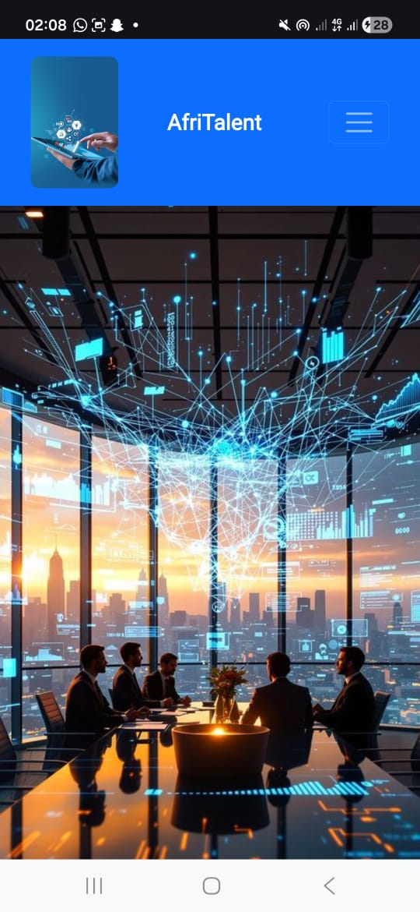
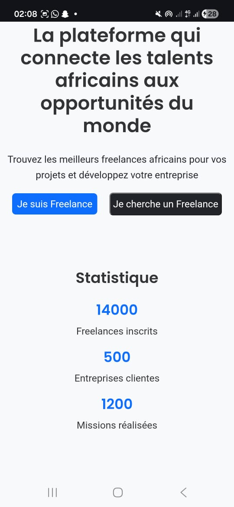

# AfriTalent
Projet fil rouge — Plateforme de mise en relation entre freelances africains et
clients.
Auteur : Codé Samb
Promotion : L1 IAGE — ISI

 Technologie utilisées

 HTML 5
 CSS
 Bootstrap 5
 Javascript

 Fonctionnalités  

 Mode sombre
 Filtrage des services
 Formulaire de contact
 Bouton retour en haut
 Responsive Design (tablette mobile desktop)
 Affichage des catégories de services
 Animations et interactions JavaScript
  GitHub Pages pour le déploiement

  Lien du site

  https://samb444.github.io/samb-cod-AfriTalent

  Capture d’écran

  Aperçu du site ( ) 

  

